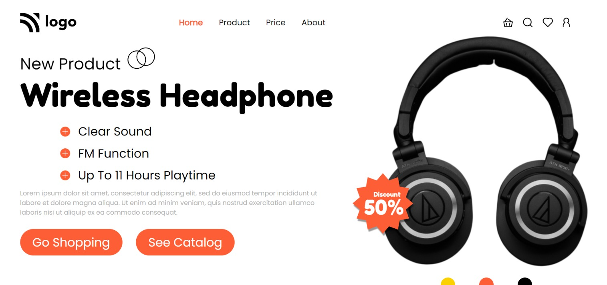

# Product Home Page

Made by **Omprasad Dornala**

## Description

This is a sample page. This webpage focuses on positioning of elements and flexbox.

## Built with

- Semantic HTML
- CSS
- Flexbox

## Key learnings

- Absolute positioning of elements.
- To apply background images.
- To design clean buttons.

## Time taken

- This project took me more than 2hrs of time.

## Deployed Version Link

- [Live Demo](https://product-home-page-op.netlify.app/)

## Snapshot of Webpage

